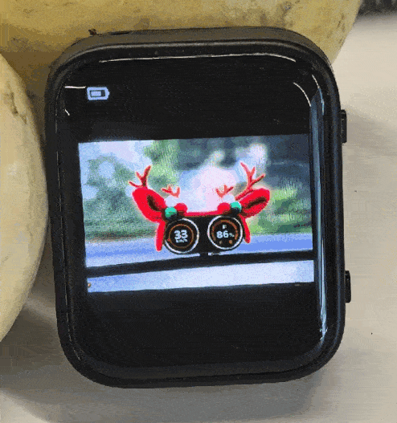

# EspIdfPhotoDisplayer

A photo auto displayer based on [ESP32-S3 1.8inch AMOLED Touch Display Development Board](https://www.waveshare.com/esp32-s3-touch-amoled-1.8.htm)

* play photo automatically, change every 2 seconds or by tapping the screen.
* show battery information on top left.




## Build with ESP-IDF

* install https://docs.espressif.com/projects/esp-idf/en/latest/esp32/get-started/linux-macos-setup.html
* build

```
. $HOME/esp/esp-idf/export.sh
```

```
idf.py build flash monitor
```
